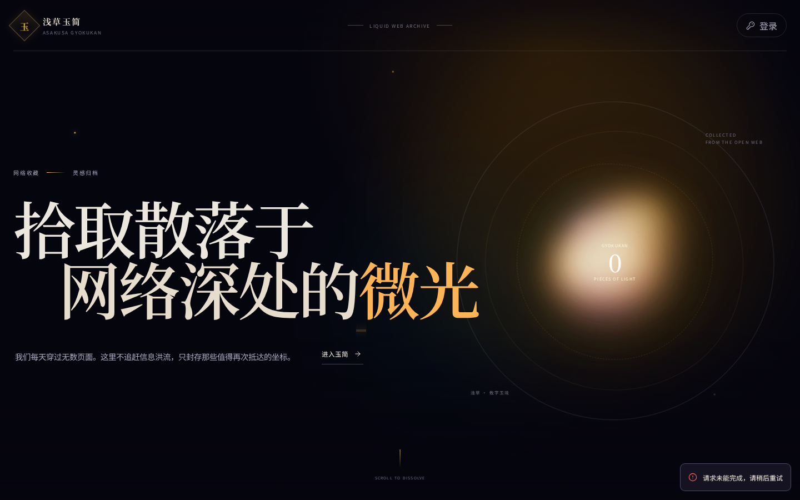

# 浅草玉简 · Asakusa Gyokukan

> 拾取散落于网络深处的微光。

[](https://workers.cloudflare.com/)
[](https://hono.dev/)
[](LICENSE)

**浅草玉简**是一个可自托管、移动端优先的个人书签收藏站：把网址、描述、分类与标签收进一方轻盈的「玉简」。它采用 Cloudflare Workers + D1，在边缘运行；没有追踪脚本，没有第三方数据库，也不要求前端框架。

> 本仓库是可独立部署的开源版本。示例与配置不包含生产数据库、域名、书签数据或任何访问凭据。



## 特性

- **收藏即数据**：书签支持标题、描述、分类、标签、强调色与公开/私有可见性。
- **简单而克制的鉴权**：单管理员密码以 PBKDF2-HMAC-SHA256（100,000 次迭代）保存；会话为 HttpOnly、Secure、SameSite=Strict Cookie。
- **为自动化保留入口**：可选 Bearer API Key 供可信自动化工具写入；服务端只保存其 SHA-256 哈希。
- **隐私边界明确**：未登录访问者只会得到公开书签；导出、编辑、删除均需要管理员身份。
- **数据可携带**：`GET /api/export` 输出完整 JSON 备份。
- **不破坏历史的删除**：软删除与「仅未删除记录唯一」URL 索引，允许重新收藏已移除的网址。
- **偏爱移动端**：响应式布局、键盘可用的交互与 `prefers-reduced-motion` 动效降级。

## 架构

```text
浏览器
  │
  ├── 静态 SPA（Vite + 原生 TypeScript）
  │
Cloudflare Worker（Hono）
  ├── /api/* 认证、书签、导出接口
  └── ASSETS 静态资源
  │
Cloudflare D1
  ├── agy_bookmarks
  └── agy_settings
```

| 层 | 选型 |
| --- | --- |
| 边缘运行时 | Cloudflare Workers |
| API | Hono |
| 数据库 | Cloudflare D1 / SQLite |
| 前端 | 原生 TypeScript、Vite、lucide |
| 测试 | Vitest |

## 快速开始（Cloudflare）

### 1. 前置条件

- Node.js 20+ 与 npm
- 一个 Cloudflare 账号
- 已登录 Wrangler：`npx wrangler login`

```bash
git clone https://github.com/Asakushen/asakusa-gyokukan-oss.git
cd asakusa-gyokukan
npm install
```

### 2. 创建自己的 D1 数据库

```bash
npx wrangler d1 create asakusa-gyokukan
```

命令会打印一个 database ID。把它填入 `wrangler.toml` 的 `database_id`，**不要使用或复用别人的 D1 ID**。

然后执行远程迁移：

```bash
npm run db:remote
```

本地开发数据库则运行：

```bash
npm run db:local
```

### 3. 生成并配置密钥

应用需要三项 Worker Secret：

| Secret | 用途 | 生成方式 |
| --- | --- | --- |
| `ADMIN_PASSWORD_HASH` | 管理员密码的 PBKDF2 哈希 | `npx tsx gen-hash-100k.ts '选择一个强密码'` |
| `SESSION_SECRET` | 会话签名密钥 | `openssl rand -base64 48` |
| `API_KEY_HASH` | 可选 API Key 的 SHA-256 哈希 | 见下方命令 |

创建一个 API key（可选，原值只显示一次）：

```bash
API_KEY="agy_$(openssl rand -hex 32)"
printf '保存到你的密码管理器：%s\n' "$API_KEY"
printf '%s' "$API_KEY" | sha256sum | cut -d' ' -f1
```

把以上值逐个写入 Cloudflare（终端会安全地提示输入）：

```bash
npx wrangler secret put ADMIN_PASSWORD_HASH
npx wrangler secret put SESSION_SECRET
npx wrangler secret put API_KEY_HASH
```

用于本地开发时，创建未提交的 `.dev.vars`：

```dotenv
ADMIN_PASSWORD_HASH=100000:your-salt:your-hash
SESSION_SECRET=your-local-random-secret
API_KEY_HASH=sha256-hex-of-an-optional-local-api-key
```

`.dev.vars` 已被 `.gitignore` 排除。绝不要提交它、真实 API key、管理员密码或生产数据库导出文件。

### 4. 验证并部署

```bash
npm test
npm run typecheck
npm run build
npm run deploy
```

部署后打开 Worker URL，并检查：

```bash
curl -s https://YOUR_WORKER.workers.dev/api/health
# {"ok":true,"service":"浅草玉简"}
```

可在 Cloudflare Dashboard 为 Worker 绑定自定义域名。

## 日常开发

```bash
npm run dev           # 本地 Vite + Worker 开发环境
npm test              # 运行 7 项单元测试
npm run typecheck     # TypeScript 检查
npm run build         # 生产构建
```

项目结构：

```text
src/
  main.ts              # 前端状态与渲染
  style.css            # token、动效与响应式样式
  jade-canvas.ts       # 背景画布
  worker/
    index.ts           # Worker 入口
    app.ts             # Hono API 与数据操作
    auth.ts            # 密码、会话与签名逻辑
migrations/            # D1 schema
public/                # 静态资源
wrangler.toml          # 需填入你自己的 D1 database ID
```

## API 摘要

| 方法 | 路径 | 说明 |
| --- | --- | --- |
| `GET` | `/api/health` | 健康检查 |
| `POST` | `/api/auth/login` | 管理员密码登录 |
| `POST` | `/api/auth/logout` | 清除会话 |
| `GET` | `/api/session` | 会话状态 |
| `GET` | `/api/bookmarks` | 列表；支持 `q` 与 `category` |
| `POST` | `/api/bookmarks` | 新建（管理员会话或 Bearer API key） |
| `PUT` | `/api/bookmarks/:id` | 修改 |
| `DELETE` | `/api/bookmarks/:id` | 软删除 |
| `POST` | `/api/bookmarks/:id/click` | 记录公开书签点击 |
| `GET` | `/api/meta` | 数量与分类统计 |
| `GET` | `/api/export` | 导出完整 JSON（需管理员身份） |

写入示例：

```bash
curl -X POST https://YOUR_WORKER.workers.dev/api/bookmarks \
  -H "Authorization: Bearer $API_KEY" \
  -H 'Content-Type: application/json' \
  --data '{
    "title":"Hono",
    "url":"https://hono.dev/",
    "description":"轻量级 Web 标准框架",
    "category":"开发",
    "tags":["TypeScript","Edge"],
    "visibility":"private",
    "accent":"jade"
  }'
```

## 备份与恢复建议

- 定期以登录态调用 `/api/export`，并把得到的 JSON 放进受保护的备份位置。
- D1 还原、迁移或删除前，先执行 `wrangler d1 export` 并确认目标数据库 ID。
- 不要把个人书签导出、`.dev.vars`、`.wrangler/` 或构建产物提交到 Git。

## 安全说明

- 生产密钥仅通过 `wrangler secret put` 管理；仓库不保存明文密钥。
- API key 拥有与管理员会话相同的写入权限。只给受信任的自动化系统，泄露时立即生成新 key 并更新 `API_KEY_HASH`。
- 当前实现适合**单管理员、低到中等风险的个人部署**；若要面向多用户或高风险场景，应在 Worker 前增加身份提供商、速率限制、审计日志与 CSRF 防护策略。
- 发现安全问题请勿公开 issue；请通过 GitHub 个人资料中的私密联系方式报告。

## 开源许可

本项目采用 [MIT License](LICENSE) 发布。欢迎 fork、改造与部署；若它成为你日常收集网络微光的小小容器，我会很高兴。
